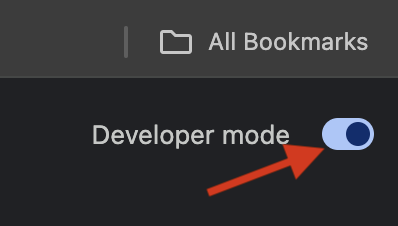
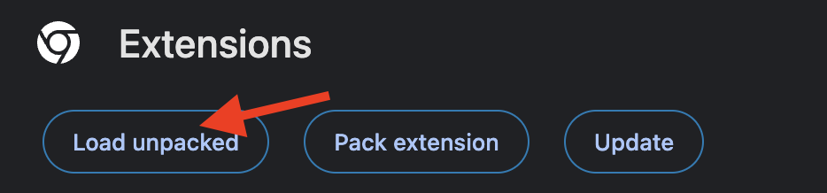
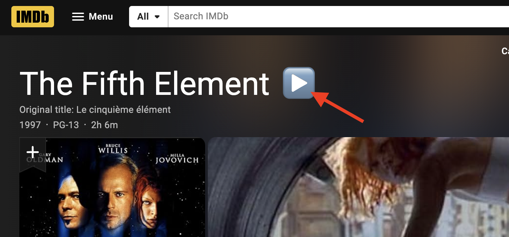

# IMDbPlay

IMDbPlay is a Google Chrome extension to play movies and TV shows directly from their IMDb pages.

Due to the nature of this extension it won't be published via the Google Chrome extension store. However, you can load it in developer 
mode to see how it works. 

# New! Tampermonkey userscript

You can now use IMDbPlay via Tampermonkey and other similar extensions. Install [Tampermonkey](https://www.tampermonkey.net/), then [install IMDbPlay](https://github.com/avramovic/IMDbPlay/raw/master/IMDbPlay.user.js).

## Installation

1. Clone this repository in ~/IMDbPlay

```bash
cd ~
git clone git@github.com:avramovic/IMDbPlay.git
```

1. Alternatively, download ZIP from GitHub (Code > Download ZIP) and unzip to the same location
2. In Chrome, open <a href="chrome://extensions">chrome://extensions</a>
3. Enable "Developer mode" on the right side



4. Click on "Load Unpacked" and navigate to ~/IMDbPlay




## Updating

1. Check for updates using git

```bash
cd ~/IMDbPlay
git pull
```

1. Alternatively, just download the ZIP file again and unzip to the same location
2. If it says "already up to date" you can stop, there are no updates
3. In Chrome, open <a href="chrome://extensions">chrome://extensions</a>
4. Find IMDbPlay and click on the Reload (🔄) icon

## Usage

- Navigate to any movie or TV show IMDb page. A "play" icon (▶️) should appear after the movie/TV show title.
- Click it to play in an overlay (click) or in a new tab (ctrl+click, or cmd+click on Mac)



- That's it! 😉🎬🍿🎦

## Contributing

Pull requests are welcome. For major changes, please open an issue first  to discuss what you would like to change.

## Features

- Play movies from their IMDb page
- Play TV shows from their IMDb page

## TODO

- Play individual TV show episodes from their IMDb pages
- Play TV show seasons from their IMDb pages 

## License

[MIT](https://choosealicense.com/licenses/mit/)

## Disclaimer

The IMDbPlay extension is designed solely for educational purposes and to demonstrate the use of browser extensions and web technologies. It does not promote, encourage, or support any form of piracy or illegal activity. The content provided by this extension is not hosted, controlled, or endorsed by this extension, and users should always respect the terms of service and copyright laws associated with the platforms they use. This extension is not affiliated with IMDb or any other third-party service.